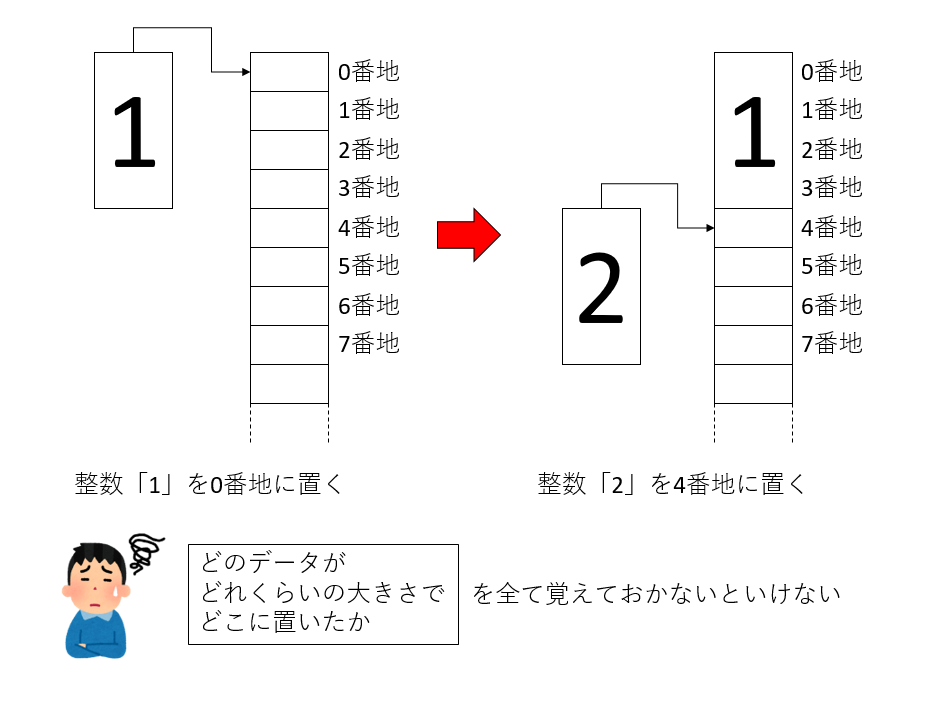
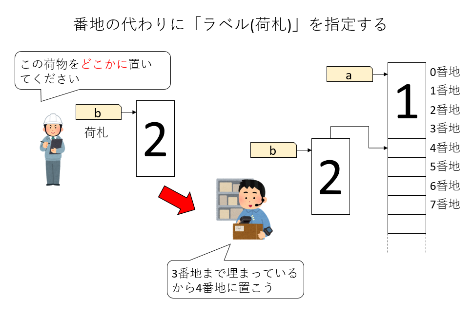
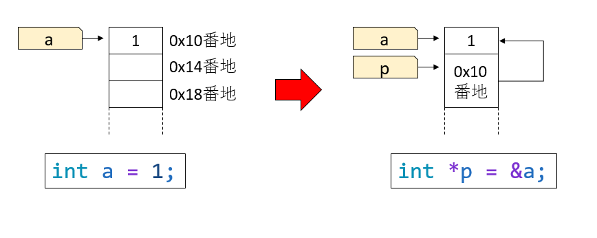

# ポインタと配列

C/C++において、初学者の鬼門となるのがポインタの概念である。モダンなC++においては、生のポインタを意識することはほとんどなくなったのだが、SIMD化など、低レイヤを考える場合には避けて通ることはできない。

また、個人的にはプログラムの動作を理解するのに、ポインタのようなものを先に理解してしまった方がいろいろ捗るのではないかと思う。

ここでは、C++(というかC言語)のポインタについて説明する。

## 変数とメモリ

Pythonの講義でも触れたが、変数というのはメモリにつけられたラベルである。我々がデータを扱う際、そのデータをメモリに置いて、それを操作する。コンピュータのメモリは、馬鹿でかい一次元配列のようなものだ。メモリには「アドレス」と呼ばれる連続の「番地」がふられている。コンピュータは、例えば「1+2」を計算する際、

* 「1」のデータをメモリに置く
* 「2」のデータをメモリに置く
* 「1」のデータをメモリから取ってきてレジスタに載せる
* 「2」のデータをメモリから取ってきてレジスタに載せる
* 足し算をする
* 結果である「3」をメモリに書き戻す

といった作業をする。さて、メモリからデータを取ってくるには、番地を指定する必要がある。なので、プログラマは「どの番地に、どんなデータを置いているか」を自分で覚えておかなければならない。

また、「1」のデータと「2」のデータは重なってはいけないが、隙間があいてもメモリがもったいない。なので「1」はどこに置いたか、データが何バイトあるかを考えて、「2」のデータをおかなければならない。例えば整数は4バイトなので、「1」を0番地に置いたら、次は「2」を4番地に置く必要がある。例えば2番地や3番地に次のデータを置いたら、前のデータは破壊されてしまう。



このように、原初のプログラムでは「どのデータが」「どのくらいの大きさで」「どこに置いたか」を全てプログラマが覚えておかなければならなかった。

そんな面倒なことをいちいちやってられないので、コンピュータに任せたくなるのが人情だ。そこでメモリの「番地」にラベルを貼ることにしよう。人間はデータにラベルを貼り、それをデータ管理人に「適当に置いてください」と以来する。するとデータ管理人は、データのサイズを見て、メモリのどこに置くかを決める。データが欲しい時には、ラベルを言って持ってきてもらえばよい。



このラベルが「変数」、データ管理人が言語処理系だ。Pythonは実行時にデータをどこに置くか決めるが、C++はコンパイル時に場所を決める。

とは言え、メモリの「番地」はあまり実感がわかないであろう。そこで、この番地を直接見てみることにしよう。

## 変数のアドレス

まず、`int`型の変数`a`を宣言しよう。

```cpp
int a;
```

C++では、コンパイル時にこの変数`a`がメモリのどこに置かれるかが決定される。その場所を「アドレス」と呼ぶ。ある変数のアドレスを知るには、その変数に`&`を付ければ良い。

```cpp
#include <cstdio>

int a;
int main(){
  printf("%p\n",&a);
}
```

実行結果は環境によるが、例えば以下のような結果が得られる。

```sh
$ g++ address.cpp
$ ./a.out
0x7f58d1c01014
```

変数`a`のアドレス、すなわち`a`が指すデータが置かれたメモリの場所が、`0x7f58d1c01014`番地であることがわかる。なお、頭の`0x`は、この値が16進法表記であることを示す。

先ほどのコードに、変数を一つ増やしてみよう。

```cpp
#include <cstdio>

int a;
int b;
int main(){
  printf("%p\n",&a);
  printf("%p\n",&b);
}
```

`int a;`の次に、`int b;`を置いた。`int`型は4バイトなので、`b`は`a`の4バイト分後に置かれるはずである。コンパイル、実行してみよう。

```sh
$ g++ address2.cpp
$ ./a.out
0x7f1d66601014
0x7f1d66601018
```

最後二桁だけ見ると、`a`のアドレスが`0x14`番地に、`b`のアドレスが`0x18`番地となり、期待通り`b`が`a`の4バイトあとに配置された。

`int a;`を、`double a`に変えてみよう。

```cpp
#include <cstdio>

double a;
int b;
int main(){
  printf("%p\n",&a);
  printf("%p\n",&b);
}
```

実行結果は例えばこうなる。

```sh
$ g++ address3.cpp
$ ./a.out
0x7feb30e01018
0x7feb30e01020
```

最後の二桁を見ると、`double a`が`0x18`番地に、`int b`が`20x0`番地に配置された。これは16進法で表示されているので、10進法になおすと、24番地と32番地となり、8バイトずれていることがわかる。これは`double a`が倍精度実数で64ビット、8バイトであることによる。

## ポインタ

さて、`int a`は`int`型の変数を宣言しており、`&a`は、そのアドレスを指す。この「`int`型の変数のアドレス」を指す変数を作ることができる。これが「ポインタ」である。

ポインタは、型の後に`*`マークをつけて宣言する。

```cpp
int *p;
```

これにより、`p`は「`int`型の変数のアドレスを指す変数」となる。例えば、`int`型の変数`a`のアドレス、`&a`を`p`に代入することができる。

```cpp
int a;
int *p;
p = &a; // aのアドレスをpに代入する。
```

この時、`p`には`a`の「アドレス」が入っている。つまり、`a`の場所を「指して(pointing)」いるので、`p`はポインタ(pointer)と呼ばれる。



`int`だろうが`double`だろうが、どのような型のデータであろうと、メモリ上でのアドレスは番地で指定できる。

例えば、以下のようなコードを考えてみよう。

```cpp
#include <cstdio>

int i;
double d;
int *pi = &i;
double *pd = &d;

int main(){
  printf("%p\n", pi);
  printf("%p\n", pd);
}
```

コンパイル、実行してみると、

```sh
$ g++ pointer.cpp
$ ./a.out
0x7fa791001028
0x7fa791001030
```

`int *`型のpiと、`double *`型のpd、どちらもアドレスを値として持っていることがわかる。

しかし、ポインタにも「型」があり、例えば`double`を指すポインタである`double *`型のポインタは、`int`の変数のアドレスを受け取ることができない。

```cpp
  int a;
  double *p = &a;　// ←ここでコンパイルエラーになる
```

では、なぜポインタに型が必要か。実は、ポインタの型は、加減算をしたときにその違いが現れる。こんなコードを考えてみよう。

```cpp
#include <cstdio>

int main(){
  int *pi = 0;
  double *pd = 0;
  printf("%p\n",pi+1);
  printf("%p\n",pd+1);
}
```

`int *`型のポインタ`pi`と、`double *`型のポインタ`pd`を0で初期化し、それぞれ1を足したアドレスを表示している。結果は以下のようになる。

```sh
$ g++ pointer_inc.cpp
$ ./a.out
0x4
0x8
```

`pi`も`pd`も0番地のアドレスを指していたが、`pi+1`は`0x4`番地を指している。これは、`pi+1`は、「`pi`が指すアドレスから`int`一個分だけ後ろのアドレス」を意味するからだ。`pd+1`が`0x8`番地を指す理由も同様である。
